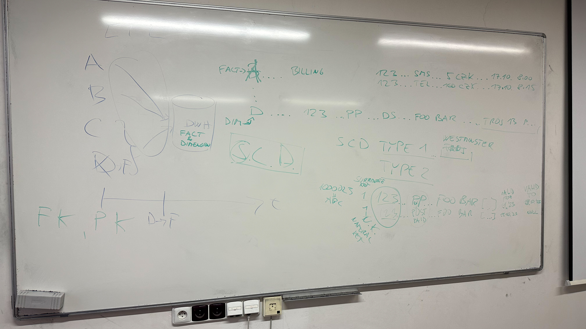

# Lecture #2: What the "Extract, Transform, and Load (ETL)" is all about?

_October 19 2023_

How to start building a data warehouse... Or, how to approach the storage of data you want to analyze on regular basis, efficiently — either ad-hoc, or automatically.

Source: [craiyon](https://www.craiyon.com)

But seriously, we are going to talk about (data) **pipelines**.

## Recommended resource for the principles of Data Warehouses

Ralph Kimball: [The Data Warehouse Toolkit](http://www.kimballgroup.com/data-warehouse-business-intelligence-resources/books/)

## Why bother? 

Because you should know at least the following two very useful tricks.

### 1. Dimensions vs Facts

See the DWH Toolkit Chapter called "Designing the Business Process Dimensional Model"

### 2. Key ETL concepts

#### a. Slowly Changing Dimension

* DWH Toolkit: Additional Design Concepts and Techniques -> **Slowly Changing Dimensions**
* See [Wikipedia](https://en.wikipedia.org/wiki/Slowly_changing_dimension) (Types 1 & 2 are the most important)

#### b. Surrogate Keys

* DWH Toolkit: Additional Design Concepts and Techniques -> **Surrogate keys**
* See more in [these](https://www.kimballgroup.com/1998/05/surrogate-keys/) [articles](http://dwgeek.com/data-warehouse-surrogate-key-design-advantages-disadvantages.html/).
    
## How?

For a practical implementation we will talk about the following set of basic options:

1. On your own (on your computer, on a server, in "the cloud"...) – not that hard for smaller data sets and simple cases, but you might need to "re-invent the wheel"
2. Using lightweight libraries, e.g. [pygrametl](http://chrthomsen.github.io/pygrametl/)
3. Cloud pay-as-you-go services, e.g. [Keboola](https://www.keboola.com/)
4. Enterprise-level solutions, e.g. [Microsoft SQL Server Integration Services](https://en.wikipedia.org/wiki/SQL_Server_Integration_Services)

## Notes:

